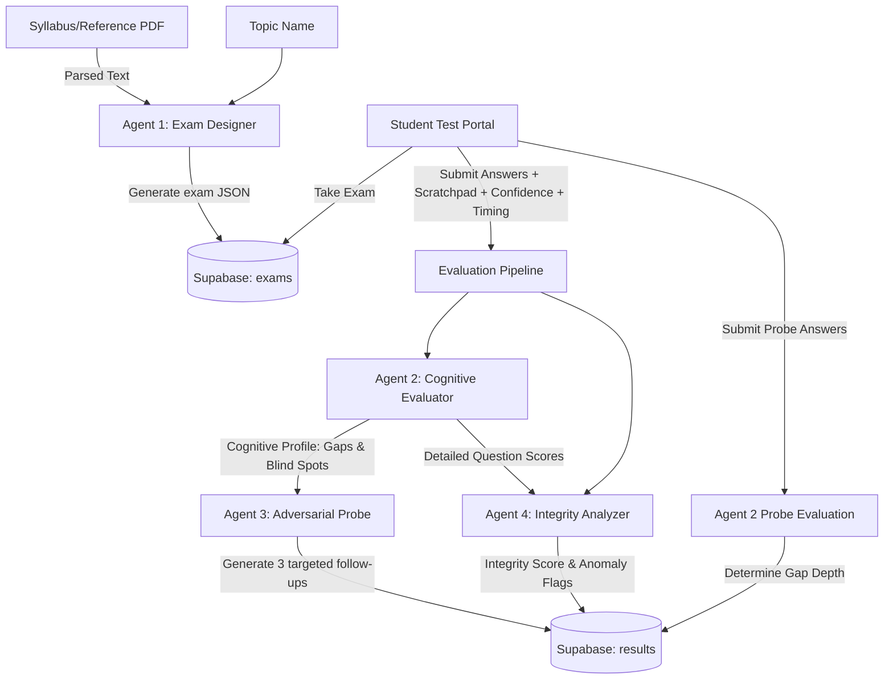

# EduAgent: Multi-Agent AI-Powered Exam & Diagnostics Platform

EduAgent is a full-stack academic assessment platform designed to move beyond traditional grade-based testing. By leveraging a multi-agent cognitive architecture powered by **Google Gemini 2.5 Flash**, EduAgent evaluates not just *what* answers a student gets wrong, but *why* they got them wrong. 

The platform runs a multi-agent evaluation pipeline that diagnoses cognitive profiles, performs adversarial follow-up probing, detects behavioral anomalies (without making definitive accusations), and compiles class-wide learning analytics.

---

## 🌟 Key Features

- **Automated Exam Generation (Agent 1)**: Upload a syllabus or reference material PDF, input a topic, and automatically generate balanced exams conforming to exact specifications (e.g., 40% easy, 40% medium, 20% hard; 60% MCQ, 40% short-answer).
- **Cognitive Evaluation (Agent 2)**: Analyzes student answers, confidence levels, scratchpad reasoning, and time spent to categorize errors (e.g., *Conceptual Gaps*, *Procedural Errors*, *Blind Spots*, *Miscalibration*).
- **Adversarial Probing (Agent 3)**: Generates 3 tougher, custom-tailored follow-up questions focusing strictly on the student's identified gaps to measure if a misconception is shallow (forgetfulness) or deep (fundamental misunderstanding).
- **Behavioral Integrity Analysis (Agent 4)**: Evaluates response speed, scratchpad length, and reasoning vs. confidence to report anomaly flags (e.g., answering hard questions instantly or guessing).
- **Dual Portals**:
  - **Teacher Portal**: Upload materials, generate exams, view class-wide diagnostic charts, track top concept gaps, and view students' individual diagnostic dashboards.
  - **Student Portal**: Take generated exams, fill in reasoning scratchpads, evaluate confidence, take follow-up adversarial probes, and view enriched cognitive report cards.

---

## 🏗️ System & Agent Architecture

EduAgent coordinates four specialized AI agents to generate, grade, and analyze assessments. 



### The 4 Specialized Agents

| Agent Name | Role | Primary Responsibility | Input Data | Output Model / Schema |
|---|---|---|---|---|
| **Agent 1: Exam Designer** | Content Generation | Creates structured exam questions with hard difficulty and type constraints. | Topic + PDF reference text | `{ topic: string, questions: [...] }` |
| **Agent 2: Cognitive Evaluator** | Diagnostics | Categorizes student performance and cognitive errors per-question. | Question + Student answer + Scratchpad + Confidence + Time | `{ is_correct: bool, score: 0-10, error_type: string, concept_gap: string, reasoning_quality: string, confidence_accuracy: string }` |
| **Agent 3: Adversarial Probe** | Deep Probing | Creates custom follow-up questions targeting the student's specific gaps to check gap depth. | Student's blind spots + conceptual gaps + exam topic | `{ probe_questions: [ { text, targets_gap, why_harder, correct_answer } ] }` |
| **Agent 4: Integrity Analyzer** | Security / Quality | Identifies abnormal behavioral patterns without making definitive accusations. | Student answers + time spent + confidence + evaluation scores | `{ integrity_score: 0-100, flags: [ { type, evidence, severity } ], summary: string }` |

---

## 💾 Database Schema

The database uses a PostgreSQL instance hosted on Supabase with the following two tables:

### 1. `exams`
Stores generated exams and questions.
```sql
create table exams (
  id uuid default gen_random_uuid() primary key,
  topic text,
  questions jsonb,
  created_by text,
  created_at timestamp default now()
);
```

### 2. `results`
Stores full multi-agent evaluations, integrity flags, generated probes, and depth diagnostics.
```sql
create table results (
  id uuid default gen_random_uuid() primary key,
  exam_id uuid references exams(id) on delete cascade,
  student_id text,
  evaluation jsonb,          -- Full Cognitive Evaluator profile & scores
  integrity jsonb,           -- Integrity score and anomaly flags
  probe_questions jsonb,     -- Custom questions generated by Adversarial Agent
  probe_evaluation jsonb,    -- Evaluation of the student's probe responses
  gap_depth text,            -- 'shallow' (if probe score > 60%) or 'deep' (if wrong again)
  created_at timestamp default now()
);
```

---

## 🛠️ Technology Stack

- **Backend**: Python 3.11+, FastAPI, Uvicorn, Google GenAI SDK (Gemini 2.5 Flash), PyMuPDF (PDF text parsing), python-dotenv, Supabase Python Client.
- **Frontend**: React 19, Vite, Recharts (visual charts), Tailwind CSS, Lucide React (icons).
- **Database**: Supabase (PostgreSQL).

---

## 🚀 Setup & Installation Instructions

### 1. Database Setup
1. Create a project at [Supabase](https://supabase.com/).
2. Go to the **SQL Editor** in your Supabase dashboard and run the code block found in [schema.sql](file:///e:/Eduagent/schema.sql) to create the necessary tables.

### 2. Environment Configuration
Create a file named `.env` in the root workspace directory (you can copy [.env.example](file:///e:/Eduagent/.env.example)) and fill in your keys:

```env
GEMINI_API_KEY=your_actual_gemini_api_key_here
SUPABASE_URL=your_actual_supabase_url_here
SUPABASE_KEY=your_actual_supabase_anon_or_service_role_key_here
FRONTEND_URL=http://localhost:5173
```

### 3. Install Python Backend Dependencies
From the root directory, run:
```powershell
python -m pip install -r requirements.txt
```

### 4. Start the FastAPI Backend
From the root directory, execute the main script as a module:
```powershell
python -m backend.main
```
The server will run on `http://localhost:8000`. You can access the automatic documentation at `http://localhost:8000/docs`.

### 5. Install Frontend Dependencies & Start React
Navigate to the `frontend` folder, install npm packages, and run the Vite dev server:
```powershell
cd frontend
npm install
npm run dev
```
The frontend portal will open on `http://localhost:5173`.

---

## 📡 API Reference

### Exams Routing (`/api/exams`)
- **`POST /api/exams/generate`**: Creates an exam by parsing an uploaded syllabus PDF and applying constraints.
- **`GET /api/exams`**: Lists all generated exams, including student attempt counts and average class scores.
- **`GET /api/exams/{exam_id}`**: Retrieves questions for a specific exam.
- **`POST /api/exams/{exam_id}/submit`**: Submits exam answers, triggering the Evaluator, Integrity, and Adversarial Probe pipeline. Returns results and the 3 custom-generated probe questions.
- **`POST /api/exams/{exam_id}/probe/submit`**: Submits answers to the follow-up probe questions. Evaluates responses and updates the student's gap depth to `"shallow"` or `"deep"`.

### Students Routing (`/api/students` & `/api/exams/{exam_id}/student/{student_id}`)
- **`GET /api/exams/{exam_id}/student/{student_id}`**: Retrieves a student's enriched cognitive profile, score, and integrity reports.
- **`GET /api/students/{student_id}/submissions`**: Retrieves all exam attempts made by a specific student.

### Analytics Routing (`/api/exams/{exam_id}/report`)
- **`GET /api/exams/{exam_id}/report`**: Aggregates exam metrics across all students, providing class average scores, error type distribution counters, top concept gaps, and compiled integrity flags.
